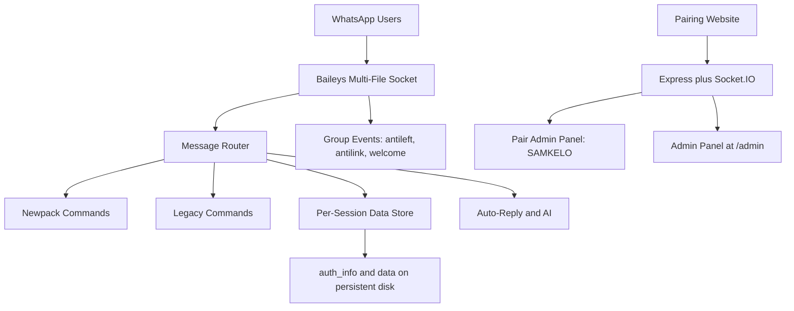

<div align="center">


# ⚡ 𝘡𝘌𝘗𝘏𝘠𝘙-𝘔𝘋

### The multi-number WhatsApp automation bot that runs itself.

**190+ commands · Isolated per-number sessions · Smart moderation · AI chat · Dual admin panels · One-click deploy**

<br />

[](https://nodejs.org)
[](https://github.com/WhiskeySockets/Baileys)
[](https://github.com/Samkelo119/Zephyr-repo)
[](https://render.com/deploy?repo=https://github.com/Samkelo119/Zephyr-repo)
[](https://github.com/Samkelo119/Zephyr-repo/pulls)

<br />

[](https://render.com/deploy?repo=https://github.com/Samkelo119/Zephyr-repo)

**[Repository](https://github.com/Samkelo119/Zephyr-repo)** · **[WhatsApp Channel](https://whatsapp.com/channel/0029Vb8p6DV8aKvNTp6n8n45)** · **[Community Group](https://chat.whatsapp.com/Bgj197mqQu96rsQiAtCJOC)**

</div>

---

## 📖 Table of Contents

- [Why ZEPHYR-MD](#-why-zephyr-md)
- [Feature Highlights](#-feature-highlights)
- [Architecture](#-architecture)
- [Quick Start](#-quick-start)
- [Pairing a Number](#-pairing-a-number)
- [Per-Number Isolation](#-per-number-isolation)
- [Admin Panels](#-admin-panels)
- [Deployment](#-deployment)
- [Environment Variables](#️-environment-variables)
- [Command Library](#-command-library)
- [Notable Commands](#-notable-commands)
- [Project Structure](#️-project-structure)
- [Security](#-security)
- [Changelog](#-changelog)
- [Credits](#-credits)

---

## ✨ Why ZEPHYR-MD

Most WhatsApp bots bolt every number onto one shared blob of state — change a
setting on one number and every other number changes with it. **ZEPHYR-MD is
built the other way around:** each paired number is a fully isolated tenant
with its own session, its own settings, its own command prefix, and its own
statistics. Pair ten numbers, and they behave like ten independent bots.

| | |
|---|---|
| 🧠 | **190+ commands** — downloads, group tools, fun, utilities, math, media and more |
| 🔒 | **True multi-tenant sessions** — per-number data, prefix and toggles, never shared |
| 🛡️ | **Admin-aware anti-left** — never re-adds someone an admin removed; only undoes genuine self-leaves |
| 🎨 | **Per-number channel reactions** — every paired number reacts differently, on a stable daily rotation |
| 🤖 | **AI chat** (`.ai`) with any OpenAI-compatible key, hot-swappable from the panel |
| 🖥️ | **Two dashboards** — a public pairing site and a password-protected control center |
| 🚀 | **One-click Render deploy** with a persistent disk, plus Railway / VPS / Termux support |
| ♻️ | **Hardened for 24/7** — PM2 config, in-app memory guard, safe native-dependency loading |

---

## 🚀 Feature Highlights

<table>
<tr>
<td width="50%" valign="top">

### 🤖 Automation
- Auto-read, auto-typing, auto-recording
- Auto-react to messages & status
- Anti-call, anti-delete, antilink
- Auto-status view & save
- Keyword auto-responders
- Scheduled reminders (`.remind`)

</td>
<td width="50%" valign="top">

### 👥 Group Control
- Mute / unmute specific members
- Bad-word filtering & slow mode
- Welcome / goodbye messages
- Warnings with auto-kick
- Promote, demote, tag-all, hidetag
- Lock group info & edits

</td>
</tr>
<tr>
<td width="50%" valign="top">

### 🧰 Toolkit
- YouTube, Spotify, TikTok, Instagram, Facebook downloaders
- Sticker / image / video conversion
- QR generator, URL shortener, dns, hash
- Translate, weather, define, whois
- Encode/decode, ciphers, text effects
- BMI, loans, tips, bill split, zodiac

</td>
<td width="50%" valign="top">

### 🎛️ Control
- Public / private mode per number
- Per-number command prefix
- Feature toggles applied live
- Backup & restore full bot data
- Broadcast announcements
- Custom commands from the panel

</td>
</tr>
</table>

---

## 🏗️ Architecture



---

## ⚡ Quick Start

```bash
# Clone the repository
git clone https://github.com/Samkelo119/Zephyr-repo
cd Zephyr-repo

# Install and start — bootstrap handles npm install for you
node bootstrap.js
```

`bootstrap.js` checks whether dependencies are missing or outdated and runs
`npm install` automatically, then boots the bot. Prefer the manual route?
`npm install && node index.js` works exactly the same.

Open the URL your host gives you (or `http://localhost:3000`) to reach the
pairing site and generate a QR code or pairing code.

---

## 📱 Pairing a Number

1. Open the pairing website at `/` on your deployed URL.
2. Enter your WhatsApp number **with country code and no `+`** (e.g. `27621834910`).
3. Choose **QR code** or **pairing code**.
4. On your phone: **WhatsApp → Linked Devices → Link a Device** and scan / enter the code.

Each pairing produces its own session directory under `auth_info/`, and its own
data file under `data/session_data/` — the two never mix.

---

## 🔒 Per-Number Isolation

Every paired number gets a private sandbox:

| Layer | Where it lives | Isolated? |
|---|---|---|
| WhatsApp session | `auth_info/<session>/` | ✅ per number |
| Settings & toggles | `data/session_data/<session>.json` | ✅ per number |
| Command prefix | `lib/sessionConfig.js` store | ✅ per number |
| Statistics & warnings | `data/session_data/<session>.json` | ✅ per number |
| Channel reaction slot | `data/channel_react_index.json` | ✅ per number |

Changing the prefix on one number, muting a member on another, or toggling a
feature on a third affects **only** that number. Nothing bleeds across tenants.

---

## 🖥️ Admin Panels

### 1. Pairing-Site Panel — `[ ADMIN PANEL ]`

Open the pairing site and click **`[ ADMIN PANEL ]`** in the page, or go to
`/api/admin/...` directly.

- **Username:** `SAMKELO`  ·  **Password:** `MRDIEHARD`
- Lists every paired number with a live 🟢/🔴 status dot
- Click a number to see its runtime, groups, feature toggles, top commands
  and a live-streaming activity log

### 2. Control Center — `/admin`

- **Default password:** `𝚉𝙴𝙿𝙷𝚈𝚁 923295533214` (override with `ADMIN_PANEL_PASSWORD`)
- Overview, users & bans, live feature toggles, menu images
- Hot-swappable API keys — no redeploy
- Broadcast, backup / restore, command stats
- Custom commands and live server logs

---

## ☁️ Deployment

| Platform | Support | Persistence |
|---|---|---|
| **Render** (recommended) | `render.yaml` blueprint + 1 GB disk | ✅ persistent disk |
| Railway | `railway.json` included | ✅ volume by default |
| VPS / Katabump | `node bootstrap.js` | ✅ your own disk |
| Termux (Android) | `termux-setup.sh` | ✅ phone storage |
| Replit | `.replit` included | ⚠️ needs Reserved VM for 24/7 |
| Heroku | `Procfile` + `app.json` | ⚠️ ephemeral filesystem |

### One-click Render

[](https://render.com/deploy?repo=https://github.com/Samkelo119/Zephyr-repo)

Render reads `render.yaml`, mounts a 1 GB persistent disk at `/var/data`, and
`bootstrap.js` symlinks `auth_info/` and `data/` onto it — so your paired
sessions survive every redeploy. See **[DEPLOY.md](./DEPLOY.md)** for the full
walkthrough and free-plan caveats.

---

## ⚙️ Environment Variables

| Variable | Purpose | Default |
|---|---|---|
| `OWNER_NUMBER` | Your WhatsApp number, country code, no `+` | `27621834910` |
| `PORT` | Web / health-check port | `3000` |
| `ADMIN_PANEL_PASSWORD` | Overrides the `/admin` password | `𝚉𝙴𝙿𝙷𝚈𝚁 923295533214` |
| `PAIR_ADMIN_USER` | Pairing-site admin username | `SAMKELO` |
| `PAIR_ADMIN_PASS` | Pairing-site admin password | `MRDIEHARD` |
| `DATA_PERSIST_DIR` | Directory to persist `auth_info/` + `data/` | unset |
| `APP_URL` | Public base URL used in generated links | auto-detected |
| `OPENAI_API_KEY` | For `.ai` (also settable from the panel) | none |
| `AI_BASE_URL` | OpenAI-compatible endpoint | `https://api.openai.com/v1` |
| `GIPHY_API_KEY` | Reserved for GIF commands | built-in demo key |
| `OMDB_API_KEY` | For `.movie` | built-in demo key |

---

## 📚 Command Library

Run `.menu` inside WhatsApp for the live, categorized list. Rough map:

| # | Category | # | Category |
|---|---|---|---|
| 1 | General & Owner | 10 | Status tools |
| 2 | Downloaders | 11 | Advanced tools |
| 3 | Group management | 12 | Text encode / decode |
| 4 | Group admin lab | 13 | Text statistics |
| 5 | Fun & games | 14 | Numbers & math |
| 6 | Text tools | 15 | Text effects |
| 7 | Stickers & media | 16 | Personal utility |
| 8 | Web utilities | 17 | Advanced moderation |
| 9 | Anti-features | | |

<details>
<summary><b>📜 Click to expand the full command list</b></summary>

<br />

| Command | Command | Command | Command |
|---|---|---|---|
| .8ball | .dp | .love | .simdb |
| .accept | .duplicate | .lyrics | .slowmode |
| .activelist | .emoji | .membercount | .slugify |
| .addmember | .emojimix | .members | .small |
| .adminlist | .encrypt | .meme | .smallcaps |
| .admins | .exportmembers | .menu | .snakecase |
| .age | .facebook | .mf | .song |
| .ai | .fact | .mirror | .splitbill |
| .anagram | .fb | .morse | .spongebob |
| .anticall | .filter | .movie | .status |
| .antidelete | .flip | .mute | .sticker |
| .antilink | .fromroman | .mutelist | .strikethrough |
| .antistatus | .fullwidth | .note | .stylish |
| .apk | .gdrive | .owner | .tagadmins |
| .ascii | .gencode | .pair | .tagall |
| .autoreacts | .goodbye | .palindrome | .telenor |
| .autoread | .groupcount | .password | .textstats |
| .autorecording | .groupcreate | .percentage | .tiktok |
| .autoresponder | .groupdesc | .ping | .time |
| .autostatus | .groupinfo | .poll | .tip |
| .autotyping | .grouplink | .private | .titlecase |
| .ban | .groupname | .promote | .todo |
| .banwhatsapp | .hack | .public | .toimg |
| .base64 | .hash | .qr | .translate |
| .binary | .hidetag | .quote | .ud |
| .block | .hotgirl | .randomname | .unlockedit |
| .bmi | .htmlescape | .randomnum | .unlockgroup |
| .broadcast | .htmlunescape | .remind | .unmorse |
| .calc | .ig | .repeat | .unmute |
| .camelcase | .insta | .resetwarn | .unshorten |
| .caps | .inviteinfo | .reverse | .uptime |
| .charcount | .islamic | .revokelink | .urldecode |
| .chatid | .jid | .roman | .urlencode |
| .clap | .joingroup | .rot13 | .video |
| .clock | .joke | .rps | .vowelcount |
| .consonants | .kebabcase | .rules | .vowels |
| .count | .keepalive | .runtime | .vv |
| .currency | .kick | .s | .warn |
| .daysleft | .leapyear | .setgdesc | .warnings |
| .decrypt | .leavegroup | .setgname | .weather |
| .define | .leet | .setgpic | .welcome |
| .demote | .listmembers | .setname | .whois |
| .dice | .loaninterest | .ship | .wordcount |
| .discount | .lockedit | .shorturl | .zalgo |
| .dns | .lockgroup | .shuffle | .zodiac |
| .repo | .git | .github | .source |

</details>

---

## 🧩 Notable Commands

<details>
<summary><b>.filter add / remove / clear &lt;word&gt;</b></summary>

Ban specific words per group — any message containing one is auto-deleted.
Ideal for keeping a group clean without moderating around the clock.

</details>

<details>
<summary><b>.slowmode &lt;seconds&gt;</b></summary>

Rate-limits each member. `.slowmode 10` allows one message every 10 seconds per
person; `.slowmode 0` disables it.

</details>

<details>
<summary><b>.mute / .unmute</b></summary>

Reply to or tag a member to silently delete their messages until unmuted —
calms things down without removing anyone from the group.

</details>

<details>
<summary><b>.autoresponder add &lt;keyword&gt; | &lt;reply&gt;</b></summary>

```text
.autoresponder add price | Check the pinned message for our price list.
```

Anyone typing a message containing "price" gets the reply automatically.

</details>

<details>
<summary><b>.repo</b></summary>

Posts a styled card linking back to this repository — great for advertising
your fork.

</details>

---

## 🗂️ Project Structure

```text
Zephyr-repo/
├── index.js                # Main bot: socket, message router, group events
├── bootstrap.js            # Auto-installer launcher + persistent-storage setup
├── render.yaml             # Render Blueprint (web service + disk)
├── pair.html               # Pairing site + pairing-site admin panel
├── settings.js             # Brand, prefix, timezone, feature defaults
├── config.js               # Globals: owner, channel links, community group
├── ecosystem.config.js     # PM2 process config for 24/7
├── admin-panel/            # /admin control-center frontend
├── lib/
│   ├── sessionConfig.js    # Per-number prefix / command config
│   ├── channelReact.js     # Per-number channel-reaction assignment
│   ├── pairAdmin.js        # Pairing-site admin backend (SAMKELO)
│   ├── adminPanel.js       # /admin Express routes
│   ├── adminAuth.js        # Password, sessions, rate limiting
│   ├── apiKeys.js          # Hot-swappable API key store
│   └── cookie.js           # Minimal cookie helper
├── commands/               # 190+ commands grouped by theme
├── data/                   # Runtime data + per-session stores (gitignored)
├── auth_info/              # WhatsApp session credentials (gitignored)
└── DEPLOY.md               # Deployment guide for every host
```

---

## 🔐 Security

- **Least-privilege static hosting** — only `/assets`, `/tributes` and `/hosted`
  are exposed; `config.js`, `data/` and `auth_info/` are never publicly served.
- **Rate-limited admin login** — 5 failed attempts triggers a 15-minute lockout.
- **Timing-safe password checks** and signed, httpOnly session cookies.
- **No-cache headers** on every admin API route.
- **Secrets stay out of git** — `.gitignore` blocks `auth_info/`, `data/`,
  `.env` and logs.

> Never commit your `auth_info/` folder. It contains the credentials that link
> your account to the bot.

---

## 🩹 Changelog

- **Added: true per-number isolation.** Each paired number now owns its own
  data file, prefix and toggles. Changing one number can no longer affect any
  other number.
- **Fixed: admin-aware anti-left.** Baileys reports voluntary leaves and admin
  kicks as the same `remove` action, which used to make the bot re-add members
  an admin had just removed. It now trusts owner / sudo / admins / the group
  creator and only undoes genuine self-leaves.
- **Added: per-number channel reactions.** Every paired number reacts with a
  distinct emoji to channel posts, on a stable daily rotation.
- **Added: pairing-site admin panel.** Log in as `SAMKELO` to browse every
  paired number and inspect its live WhatsApp data.
- **Added: Render-ready deployment.** `render.yaml` Blueprint, persistent disk,
  and `DATA_PERSIST_DIR` support in `bootstrap.js`.
- **Security: stopped serving the project root.** Previously `config.js`,
  `data/bot_data.json` (API keys) and `auth_info/` were downloadable over HTTP.
- **Hardened for 24/7.** PM2 config with memory-based restart plus an in-app
  memory guard.
- **Fixed: duplicate "replayed" messages after reconnects** via a 60-second
  message-age guard.
- **Fixed: bot data not merging with new fields on upgrade** — data now merges
  over sane defaults on every load.
- **Fixed: a bad native dependency crashing the whole bot** — `sharp` is loaded
  safely; only `.sticker`/`.toimg` are affected if it fails.
- **Fixed: ffmpeg on Termux** — auto-detects Android and uses system ffmpeg.
- **Added:** `bootstrap.js` auto-install, the `/admin` panel, and 37+ utility
  commands.

---

## ❤️ Credits

<div align="center">

**Built and maintained by MRDIEHARD TECH**

`Samkelo119`

<br />

[](https://github.com/Samkelo119/Zephyr-repo)
[](https://whatsapp.com/channel/0029Vb8p6DV8aKvNTp6n8n45)
[](https://chat.whatsapp.com/Bgj197mqQu96rsQiAtCJOC)

<sub>Powered by Baileys · Built with Node.js · Deployed on Render</sub>

</div>
